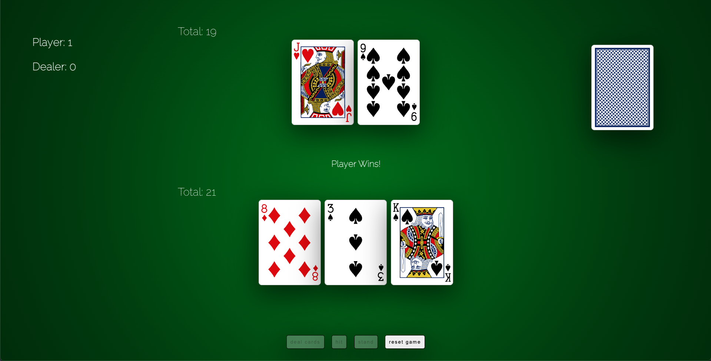
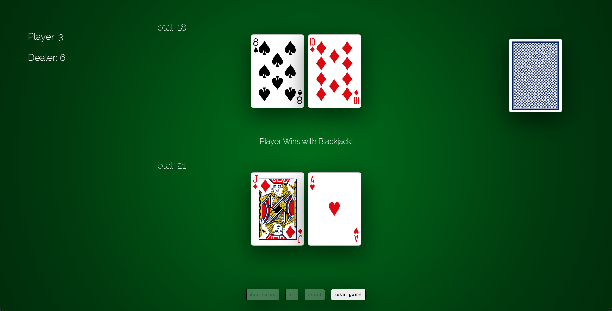
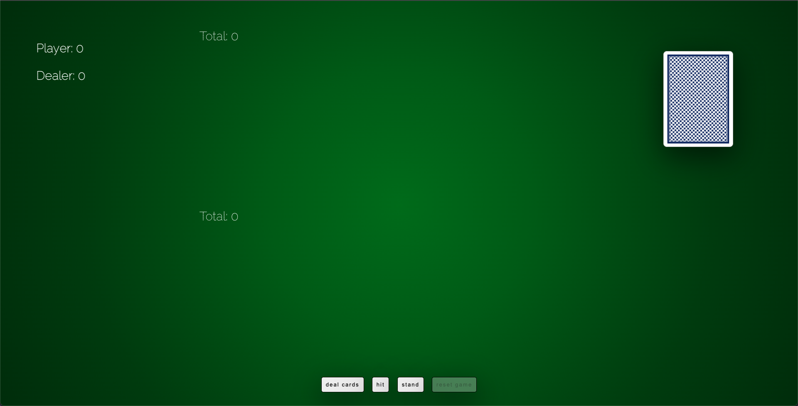

# Blackjack

A classic game of Blackjack that can be played directly in your browser. The objective of this game is to beat the dealer by have the value of your hand total 21, or get as close to 21 as possible without exceeding it. The game is played with a deck of cards, with each card having a number value. Numbered cards are worth their face value, face cards (Kings, Queens, Jacks) are worth 10, and Aces can be worth either 1 or 11.

You can win the game in any of the following ways:

- By getting a Blackjack. This is when the first two cards dealt to you have the value of 21. Note: if the dealer also gets a blackjack, it is a tie, or a 'push'.
- Having your hand's value be worth more than the dealer, while also not exceeding 21.
- The value of the dealer's hand exceeds 21, also known as a bust.

Blackjack is a combination of both strategy and luck. The game is played as so:

- Click on the deal cards button. (Clicking on the deck of cards does the same thing)
- Once receiving your hand, you can either choose to 'hit' (add another random card to your hand), or 'stand' if you do not want another card and complete your turn.
- Once you hit stand, the dealer's faced down card will turn over to reveal their hand. If the hand is below 16, the dealer will add another card to their deck. If their new total exceeds 21, you win. If the dealers hand is equal to 17, but contains an ace _(soft 17)_, they will add another card to their deck. Otherwise, whoever has the higher hand value, wins.
- Click 'reset game' to play the next round.

## Screenshots

## Technologies Used

- HTML
- CSS
- JavaScript

## Getting Started

The game can be played here: https://btb0.github.io/blackjack/

## Next Steps

Things I would like to add in the future are:

#### A Betting System

- Start the player off with $2500, and provide the option to bet prior to the hand being played. Ideally, the bets would be linked to chips that the player can click on. The betting increments would be:

    - $25
    - $50
    - $100
    - $500
    - $1000

#### Animations / Sound Effects

- Add animations and sound effects to the cards being dealt. I would like the cards to have an animation coming from the deck on the right side, to the players hand.
- An animation for the cards being flipped over as well as animations for the chips used for betting.

